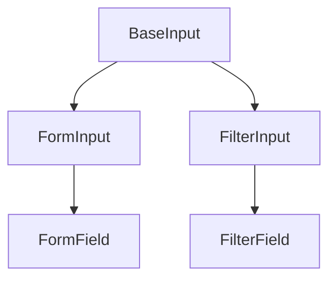
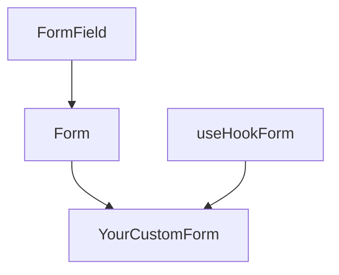
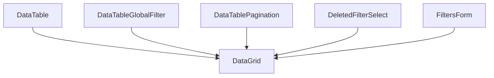
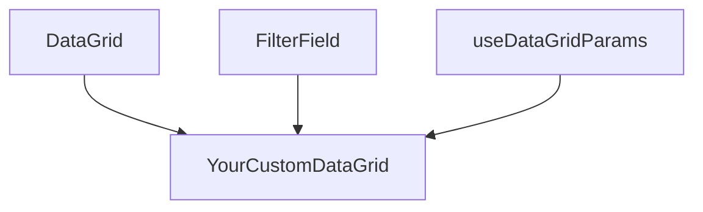

# Core Component Anatomy

There are a handful of custom components in this app that are fairly "black box". You might want to understand how the pieces fit together.

## FormField & FilterField Anatomy

- The `BaseInput` component is essentially a big switch statement that renders the various custom inputs based on the `type` prop.
- The `FormInput` component implements `BaseInput` and connects it to a field in form context, based on the `name` prop.
- The `FormField` component wraps the `FormInput` and adds visual elements like a label.
- The `FilterInput` component implements `BaseInput` and connects it to a field in filter context (used in `DataGrid` filters -- see below), based on the `name` prop.
- The `FilterField` component wraps the `FilterInput` and adds visual elements like a label.

### FormField Usage

- The `Form` component provides form context and event handling.
- The `useHookForm` hook maintains form state.

## DataGrid Anatomy

- The `DataTable` component is a stateless display of rows and configurable columns in a table.
- The `DataGrid` component assembles the various stateless components in a stacked layout.

### DataGrid Usage

- The `useDataGridParams` hook maintains state for searching, sorting, filtering, and paging. It connects to the URL query-string and session storage for a contiguous experience.
